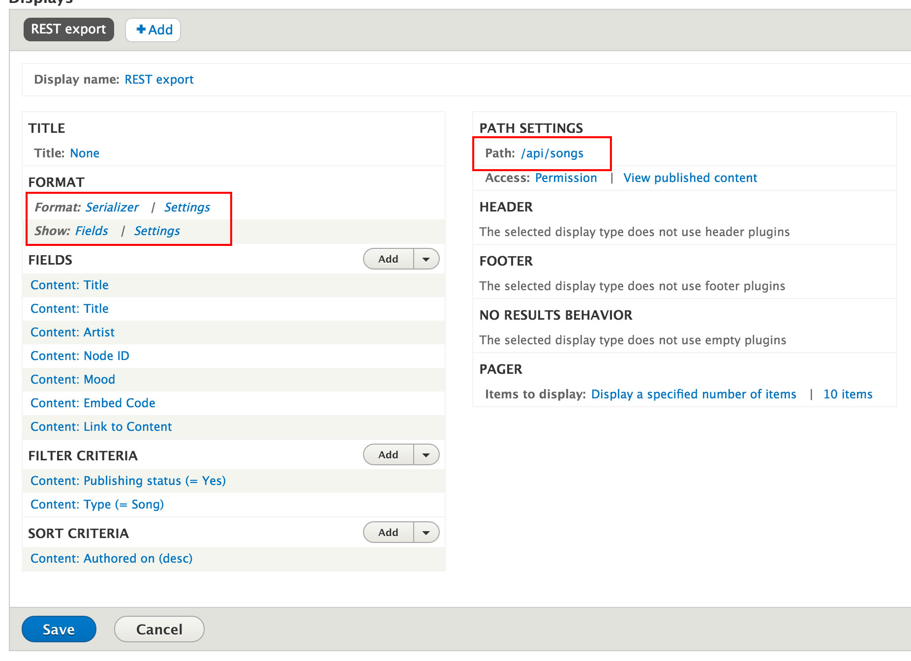
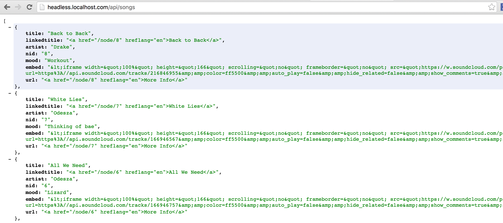
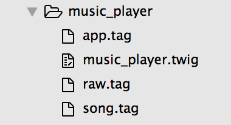
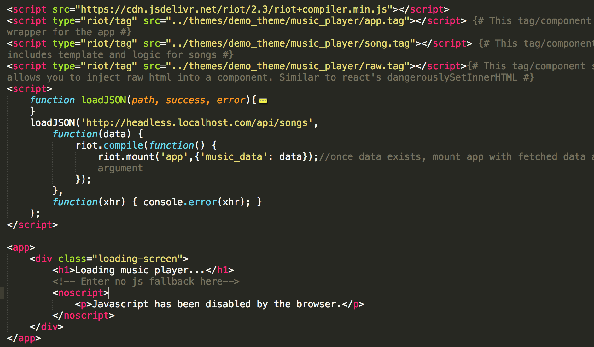
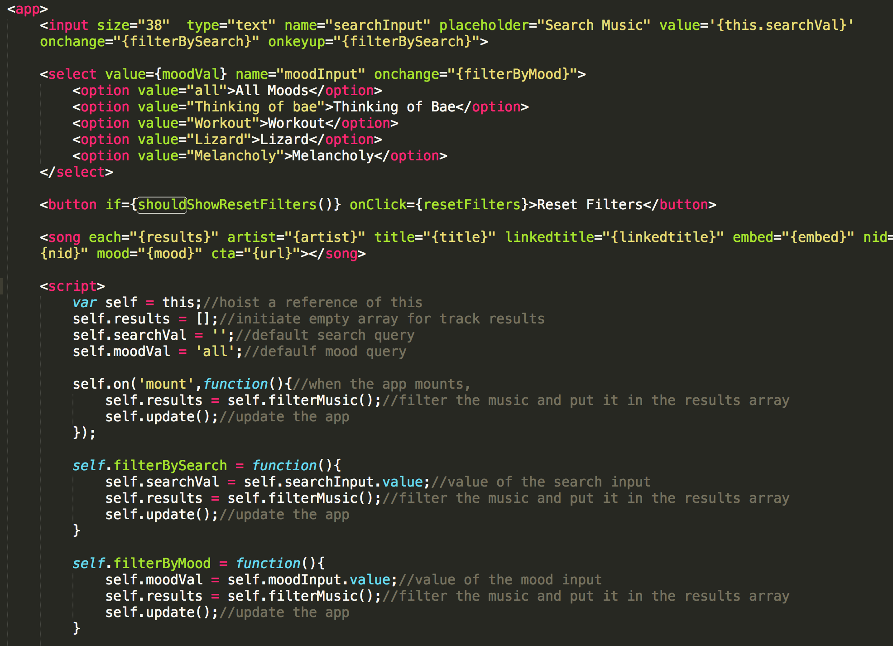
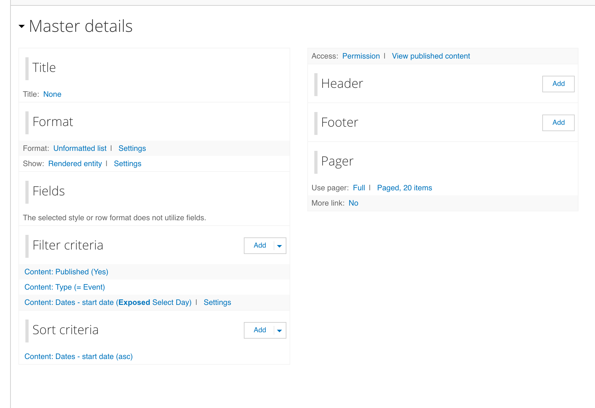
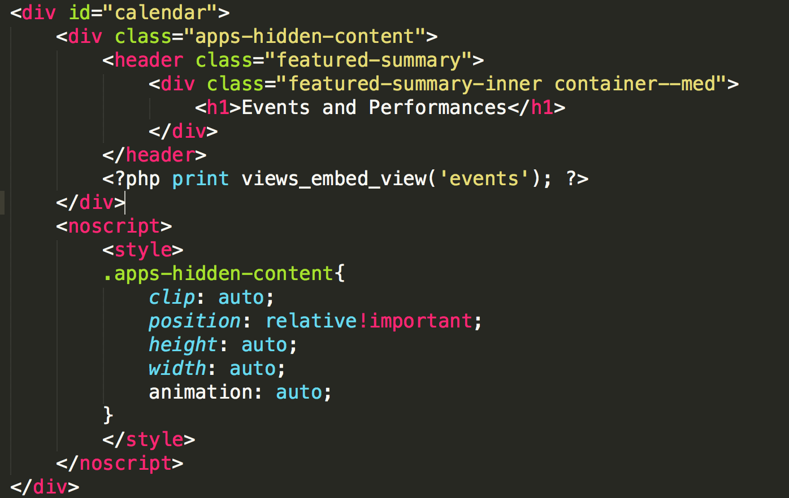

# Beheading Drupal...

#####Alternate title: Drupal, a love story

### Will Vedder :whale2:

^Really excited to give this talk

^Genuinely enjoy

^Been working with Drupal many years

^Headless work the last 1.5 years

^Lots of new, exciting stuff happening in the JS world

^Headless architectures open up lots of possibilities

^These are just my experiences

---

# Williamson Vedder :whale2:
### Dev, adjunct professor ']['


Currently @ Bluecadet
Formerly @ TU Creative Services

^So who am I?

^Bluecadet is an Emmy Award-winning digital agency that creates world-class websites, mobile apps, interactive installations, and immersive environments.

---

#🤔

^Who here has implemented a headless setup?

^...with success?

---

#Headless/Decoupled Drupal

Hard separation between theming layer and rest of CMS. Drupal acts as an API to a front-end framework like React or Angular.

^Quick definition

^Drupal sends mostly raw data

^Front-end framework consumes data and generates html

^Headless = decoupled

---

#Many Types of Headless Implementations

-Fully Decoupled

-Hybrid

-CMS to CMS

-CMS to Node.js

-CMS to Node.js to Caching service

-Many more...

^Comes in many flavors

^This talk will be focusing on the first two

---


#None (traditional)

No hard separation. Drupal handles data processing and theming. 

Think: most Drupal sites now. Business as usual.

^For the sake of comparison

---
#None (traditional) pros :thumbsup:

- Likely already pretty good at it

- Everything under the hood already

---
#None (traditional) cons  :thumbsdown:

- Slow and expensive async interactions

- Often difficult to customize markup of UI elements

- Modules are usually great but difficult to extend

- Modules blur data-theming line 


---


#Fully Decoupled

Full separation between data layer and front-end layer. 

Think: Single page apps (SPAs).


---


####hoovermason.com

^Responsive webapp

^City of Bethlehem

^Touring the evelated walkway of old steel mill ruins

^Wordpress and Angular 1

^Completely custom experience

^Traditional architecture wouldn't have made sense

---

#Fully decoupled pros :thumbsup:
- Snappy interactions via client side rendering 

- Fully customizable interfaces/markup 

- Easily swappable front-end/back-end

- Security, _generally_ :lock:

---

#Fully decoupled cons :thumbsdown:

- Missing out on some of Drupal's best features

- SEO and crawler drawbacks, _generally_

- Another framework to learn, develop,maintain

- Complexity of hosting, _generally_

- JS reliance, _generally_

^Editing in-place, menu system, routing, built-in login, built-in search, built-in 404/403. All things you’d need to rebuild.d

^Initial bootstrap for frameworks on mobile sooo slow

^Sometimes the web isn't perfect perfect

^Lots of mobile browses still have trouble with JS

^Proxy browsers, opera mini etc.

---

#Doesn't need to be all or nothing

###You can leverage the strength of both :muscle:

---


#Hybrid

Some sections of site are separated for responsive interfaces, Drupal handles rest of the theming. 

Think: dashboards, calculators.


---


^Two view modes, decoupled makes it esasy,same data

---


---
#Hybrid pros :thumbsup:

- Speedy interfaces via JS as needed,
- Sturdy Drupal rendering when not
- Basically, upsides of both
- Rollout in stages

^

---
#Hybrid cons :thumbsdown:

- Still requires another framework to learn,develop,maintain
- SEO and crawler downsides (avoidable)

---

#Four important things:

- D8 Walkthrough (everything under the hood :raised_hands:)

- What I wish I knew about APIs

- API Caching

- Server-side rendering (for SEO,crawlers) 🤖

---

#D8 Walkthrough: Gameplan

- Easy site-building
- Enable an included module
- Create a view -> your api
- Create custom template
- Create your app
- Put app into custom template


^Riot.js app, react-like

^Straightforward syntax and architecture

---

#D8 Walkthrough: First steps

- Clean install
- Duplicate Bartik for custom theme
- Create "Music Player" basic page
- Created "Song" content type:
    - Artist
    - Embed code
    - Mood :smirk:

---

#D8 Walkthrough: enable RestFul Web Services module


---

#D8 Walkthrough: create a view



---

#D8 Walkthrough: check out your amazing api



---

#D8 Walkthrough: adding to your template




---

#D8 Walkthrough: your include



---

#D8 Walkthrough: the app component



---


---
#Things I wish I knew about APIs 

#:hushed:
 
^ A disclaimer

^ Not going to stand up here and tell you how to structure your api

---
#API Reflections:

- Serve up all data at once (if possible)

- Reduce asynchronous requests (if possible)

- Drupal's schema doesn't lend itself to api creation

- Roll out custom module for best results (I do)

---

#API Caching :key:

- Very important, especially for scaling

- Doesn't need to be complicated either

- Built-in page caching already working for you

- Easy to extend with Drupal's built-in caching functions (some assembly required)

- Varnish (some assembly required)

---

#API Caching Implementation

- Set cache after expensive query

- Clear _and_ rebuild cache on content update, insertion

- Certainly opt for more performance with changes to stack

---


#Basic API Caching

---
```php
function api_custom() {
	$api_data = &drupal_static(__FUNCTION__);//
	if (!isset($api_data)) {
		if ($cache = cache_get('api_data_cache')) {
			$api_data = $cache->data;
		}
		else {
				// Do your expensive calculations here, and populate $my_data
				// with the correct stuff..
				$api_data = ['foo','bar','baz'];
				cache_set('api_data_cache', $api_data, 'cache');
		}
	}
	return json_output($api_data);
	exit;
}
```
---


#Basic API Caching w/Varnish


---

#API Caching Results 🤓


n = 10, 600+ nodes w/17 fields each, 46kb

----
#Server-side rendering

- Markup is generated for initial render

- Client handles subsequent renders

- Not waiting for JS framework bootstrap :fire:

- SEO and crawler benefits 🤖

^Remember when I mentioned server side rendering earlier?

^Server side is big deal

^React, Angular2, riotjs and more frameworks support this now

^Talk doesn't do it justice

----

#Server-side rendering implementation

- Quick and dirty solution? Use a view

- Well-engineered solution? Add a node server in your stack


^Limited hosting resources? Quick and dirty not bad

^Again, big deal, talk doesn't do it justice

^Due to limited time and resources, went with a view

___

###Server-side rendering: quick and dirty



___

###Server-side rendering: quick and dirty



---

###Server-side rendering: quick and dirty


___

#Server-side rendering: well-engineered


----
#Takeaways  :sunglasses:

The headless approach isn’t about following the trend and applying it haphazardly. It’s about engineering a product using the best of a coupled and decoupled approach that can leverage the power of all the tools and skills at your disposal. 


^Quick thanks
^Shoutout to Matt Cheney @Pantheon for diagrams and inspiration
^Special to Mark Llobrera for helping put together

----
#Want my warez?

###[github.com/willvedd/drupaldelphia-headless-demo](https://github.com/willvedd/drupaldelphia-headless-demo)
